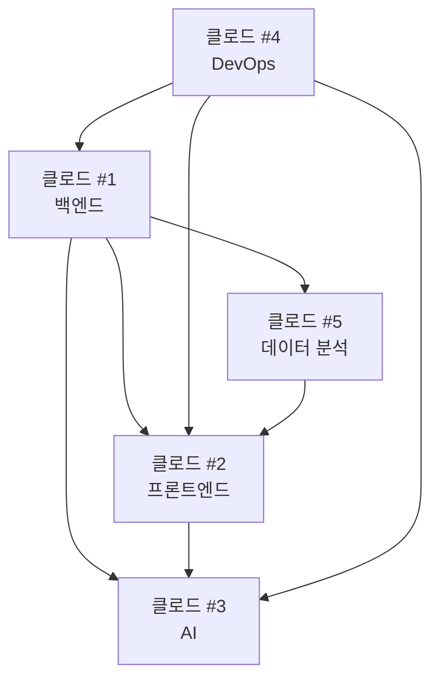

# 🤖 클로드 협업 구조 설계

## 📋 프로젝트 작업 분할

### 1️⃣ 클로드 #1 - 백엔드 아키텍트 & API 개발자
**역할**: 서버 개발, 데이터베이스, API 설계
```yaml
담당 영역:
  - Express.js 서버 개발 및 최적화
  - MySQL 데이터베이스 스키마 관리
  - RESTful API 설계 및 구현
  - JWT 인증 시스템 강화
  - 외부 API 연동 (공공데이터 포털)
  - 데이터 동기화 서비스

주요 파일:
  - server/index.js
  - server/controllers/*.js
  - server/models/*.js
  - server/services/*.js
  - server/config/database.js

API 엔드포인트:
  - POST /api/claude/backend/status
  - GET /api/claude/backend/health
  - POST /api/claude/backend/deploy
```

### 2️⃣ 클로드 #2 - 프론트엔드 개발자 & UI/UX
**역할**: React 컴포넌트 개발, 사용자 인터페이스
```yaml
담당 영역:
  - React 컴포넌트 개발
  - 반응형 UI/UX 구현
  - 상태 관리 (AuthContext 등)
  - API 연동 (Axios)
  - 라우팅 및 네비게이션
  - CSS 모듈화 및 스타일링

주요 파일:
  - client/src/App.jsx
  - client/components/*/*.jsx
  - client/src/context/*.jsx
  - client/src/styles/*.css

API 엔드포인트:
  - POST /api/claude/frontend/status
  - GET /api/claude/frontend/build
  - POST /api/claude/frontend/deploy
```

### 3️⃣ 클로드 #3 - AI & 이미지 처리 전문가
**역할**: OpenAI API 연동, 이미지 생성/처리
```yaml
담당 영역:
  - OpenAI GPT Image API 연동
  - 이미지 생성 및 편집 기능
  - Prompt 엔지니어링
  - 이미지 최적화 및 압축
  - AI 기반 추천 시스템
  - 비용 최적화 및 모니터링

주요 파일:
  - server/services/aiService.js
  - server/controllers/imageController.js
  - client/components/Maker/*.jsx
  - client/components/ImageUploader/*.jsx

API 엔드포인트:
  - POST /api/claude/ai/generate
  - GET /api/claude/ai/status
  - POST /api/claude/ai/optimize
```

### 4️⃣ 클로드 #4 - DevOps & 테스트 엔지니어
**역할**: 배포, 테스트, CI/CD, 모니터링
```yaml
담당 영역:
  - Git 워크플로우 관리
  - 자동화된 테스트 작성
  - Docker 컨테이너화
  - CI/CD 파이프라인 구축
  - 성능 모니터링
  - 보안 감사

주요 파일:
  - .github/workflows/*.yml
  - docker-compose.yml
  - server/tests/*.js
  - client/tests/*.js

API 엔드포인트:
  - POST /api/claude/devops/deploy
  - GET /api/claude/devops/metrics
  - POST /api/claude/devops/test
```

### 5️⃣ 클로드 #5 - 데이터 분석가 & 비즈니스 로직
**역할**: 데이터 분석, 비즈니스 로직, 통계
```yaml
담당 영역:
  - 사용자 행동 분석
  - 입양 통계 및 대시보드
  - 비즈니스 인텔리전스
  - 데이터 시각화
  - 성과 지표 관리
  - 사용자 세그먼테이션

주요 파일:
  - server/services/analyticsService.js
  - server/controllers/statisticsController.js
  - client/components/Analytics/*.jsx

API 엔드포인트:
  - GET /api/claude/analytics/dashboard
  - POST /api/claude/analytics/report
  - GET /api/claude/analytics/insights
```

## 🔄 의존성 매트릭스



### 의존성 관계
- **클로드 #2 → 클로드 #1**: API 엔드포인트 및 데이터 스키마 필요
- **클로드 #3 → 클로드 #1**: 이미지 저장 API 및 데이터베이스 필요
- **클로드 #3 → 클로드 #2**: UI 컴포넌트 및 사용자 인터랙션 필요
- **클로드 #5 → 클로드 #1**: 데이터베이스 접근 및 분석 API 필요
- **클로드 #5 → 클로드 #2**: 대시보드 UI 컴포넌트 필요
- **클로드 #4 → 모든**: 배포 및 테스트를 위한 전체 시스템 접근 필요

## 📡 클로드 간 통신 프로토콜

### 기본 API 구조
```typescript
interface ClaudeAPI {
  claudeId: number;
  action: string;
  payload: any;
  dependencies?: number[];
  priority: 'high' | 'medium' | 'low';
  timestamp: string;
}

interface ClaudeResponse {
  success: boolean;
  data?: any;
  error?: string;
  nextActions?: string[];
  readyFor?: number[];
}
```

### 통신 예시
```json
{
  "claudeId": 2,
  "action": "request_api_schema",
  "payload": {
    "endpoints": ["/api/animals", "/api/users"],
    "component": "Animals.jsx"
  },
  "dependencies": [1],
  "priority": "high",
  "timestamp": "2025-01-22T10:30:00Z"
}
```

## 🔧 실행 단계별 프로토콜

### Phase 1: 초기화
1. **클로드 #4**: 개발 환경 셋업 및 Git 브랜치 전략
2. **클로드 #1**: 데이터베이스 스키마 최종 확정
3. **클로드 #2**: 컴포넌트 구조 및 라우팅 계획
4. **클로드 #3**: AI API 키 설정 및 테스트 환경
5. **클로드 #5**: 분석 요구사항 및 KPI 정의

### Phase 2: 핵심 개발
1. **클로드 #1**: 핵심 API 개발 (인증, CRUD)
2. **클로드 #2**: 기본 컴포넌트 개발 (Header, Footer, Main)
3. **클로드 #3**: 기본 이미지 생성 기능 구현
4. **클로드 #4**: 테스트 환경 구축
5. **클로드 #5**: 기본 통계 수집 시스템

### Phase 3: 통합 및 연동
1. **API 연동**: 클로드 #1 ↔ 클로드 #2
2. **AI 기능 연동**: 클로드 #3 ↔ 클로드 #1, #2
3. **분석 대시보드**: 클로드 #5 ↔ 클로드 #1, #2
4. **테스트 및 QA**: 클로드 #4

### Phase 4: 최적화 및 배포
1. **성능 최적화**: 모든 클로드 협업
2. **보안 강화**: 클로드 #1, #4
3. **사용자 경험 개선**: 클로드 #2, #5
4. **운영 환경 배포**: 클로드 #4

## 📞 상호작용 시나리오

### 시나리오 1: 새로운 API 엔드포인트 추가
```yaml
1. 클로드 #2: "동물 상세 정보 API가 필요합니다"
   → POST /api/claude/request
   {
     "from": 2,
     "to": 1,
     "request": "create_endpoint",
     "spec": { "path": "/api/animals/:id", "method": "GET" }
   }

2. 클로드 #1: API 개발 후 응답
   → POST /api/claude/response
   {
     "from": 1,
     "to": 2,
     "status": "completed",
     "endpoint": "/api/animals/:id",
     "schema": { ... }
   }

3. 클로드 #2: 프론트엔드 연동 완료
   → POST /api/claude/confirm
   {
     "from": 2,
     "to": 1,
     "status": "integrated",
     "component": "AnimalDetail.jsx"
   }
```

### 시나리오 2: AI 이미지 생성 기능 추가
```yaml
1. 클로드 #3: "이미지 저장 API 필요"
   → 클로드 #1에게 요청

2. 클로드 #3: "UI 컴포넌트 필요"
   → 클로드 #2에게 요청

3. 병렬 개발 진행

4. 통합 테스트
   → 클로드 #4가 조율
```

## 🛠️ 필요한 도구 및 환경

### 공통 개발 환경
```yaml
Git Branch Strategy:
  - main: 프로덕션
  - dev: 통합 개발
  - feature/claude-{n}-{feature}: 개별 클로드 작업
  - integration/claude-{n1}-{n2}: 클로드 간 통합

Communication Tools:
  - 파일 기반: /docs/claude-communications/
  - API 기반: 내부 클로드 통신 API
  - 상태 추적: /docs/work-status.json

Code Standards:
  - ESLint + Prettier (프론트엔드)
  - 한국어 주석
  - Gitmoji 커밋 컨벤션
```

## 🎯 성공 지표

### 개발 효율성
- 각 클로드의 작업 완료율
- 의존성 해결 시간
- 통합 성공률

### 품질 지표
- 테스트 커버리지 > 80%
- 성능: 페이지 로드 < 2초
- 보안: 취약점 0개

### 협업 지표
- 클로드 간 통신 성공률
- 충돌 해결 시간
- 문서화 완성도

이제 각 클로드에게 역할을 할당하고 단계별로 작업을 시작할 수 있습니다!